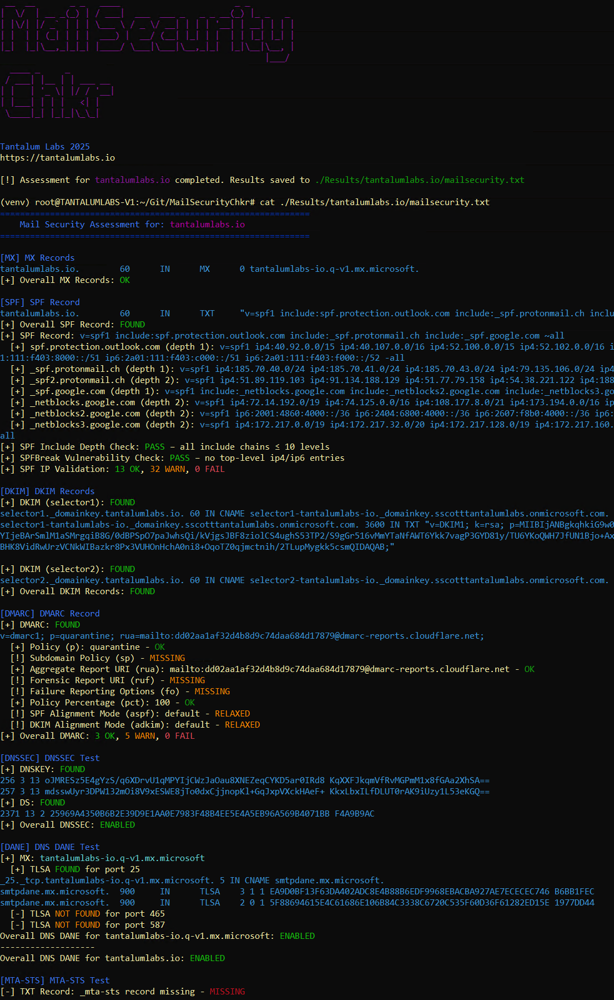

# MailSecurityChkr

This is a bash script that automates numberous mail record, mail configuration and domain configuration tests.

---

## Features

- Fully automated
- ANSI color coded report
- Tests SPF, DKIM, DMARC, TLSA, MTA-STS record existance
- Validates policies, recursion, syntax, best practices

---

## Install

   ```bash
   sudo apt update
   sudo apt install figlet spfquery -y
   git clone https://github.com/Tantalum-Labs/MailSecurityChkr
   ```
---

## Use

   Create a text file, E.g. doamins.txt, with each line containing a target domain to test.

   > **Note:** Only test primary domains hosting mail unless otherwise specified by the client.

   > **Note:** Reccomended to run as root to prevent issues with spfquery.

   Run a scan:
   ```bash
   sudo ./mailSecurityChecker.sh domains.txt
   ```

   
